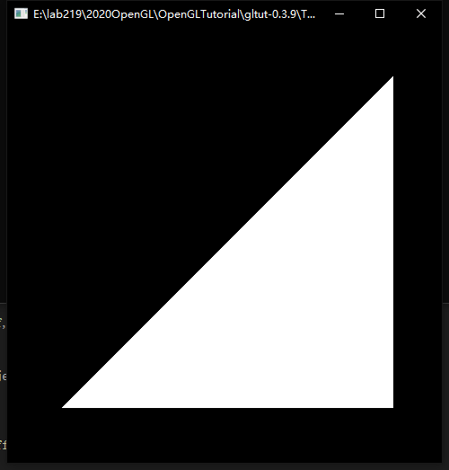
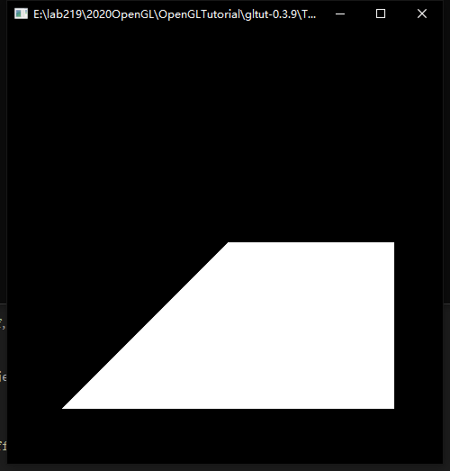
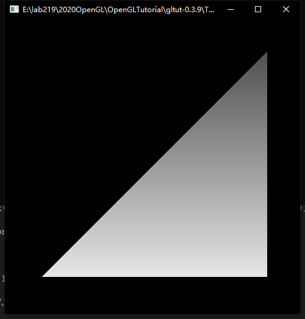
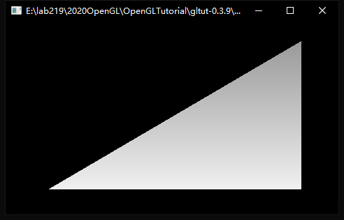

- [电子书链接](https://paroj.github.io/gltut)
- [GLSDK](http://glsdk.sourceforge.net/docs/html/index.html)
- [代码Github](https://github.com/paroj/gltut)
- (说什么不需要下载别的东西就可以运行教程代码纯属放屁，需要下载并编译GLSDK的lib文件)

教程代码编译方式：

把`GLSDK`放到`gltut/glsdk`目录，然后分别在`glsdk`目录运行
```bash
premake4 vs2010
```
然后通过VS项目打开`glsdk`并且`生成解决方案`。这样我们就有了教程所依赖的轻量级`opengl`库。

然后在`gltut`根目录也一样运行
```bash
premake4 vs2010
```
为每个项目生成解决方案。

运行每一节代码的时候，需要通过`解决方案资源管理器`把对应那一节的项目`设为启动项目`。另外，修改了代码需要重新编译的时候需要手动删除`.pdb`文件。

# Graphic and Rendering
Rendering（渲染）和 Rasterization（光栅化）：渲染指的是从3D场景到2D图片转化的过程，而光栅化是图形硬件通常使用的渲染方式，通过大量模拟、近似来达到实时渲染。用来进行光栅化的模块被称为 Rasterizer 光栅器。

光栅化的过程通常被处理为由多个过程组成的流水线，输入 triangles 面片，输出图像。需要注意的是，提交面片的顺序会影响光栅化的效率，这是因为光栅器总是按照特定顺序处理面片的，而且处理过程是流水线形式进行的。

## 光栅化总体过程
### 切割和坐标转换
将面片转换到特定空间范围内，只渲染范围内面片而忽略范围外面片。这个范围被称为 clip space，顶点在这个范围内的坐标被称为 clip coordinates.

部分位于clip space的面片会切分为更小的面片

### 归一化坐标
### 窗口坐标系转换
### 扫描
针对X、Y坐标进行扫描，对每个像素生成一个 fragment 且保证共享边的面片不会在扫描过程中产生间隙。

Z 坐标将会在之后处理 fragment 的时候发挥作用。

### Fragment处理
即对Fragment着色的过程，类似抗锯齿之类的过程也是这时候完成的。需要注意的是，处理的过程总是先处理完一个面片的fragment，再处理另一个。

### Fragment 写回
将Fragment数据写回到图片中

## 着色器
在渲染的特定阶段运行的程序，可以看做是让用户自定义渲染算法的钩子函数。

# What is OpenGL
我们常说OpenGL是一系列API，但是更准确的说，OpenGL并不限制API的语言，所以OpenGL更像是一个对于图形接口的说明，如果一个语言实现了这个接口，那么就应该满足这个说明。

针对OpenGL的一切操作都是通过API完成的，你不能拿到一个在OpenGL中定义的结构体。

OpenGL的存储管理也是不对外开放的，最直接的表现就是你不能通过`sizeof`之类的通用接口拿到一个对象的大小。所有 OpenGL 对象都通过引用的方式访问，OpenGL 通过类型`GLuint`来返回任意对象的引用，通常来说，对象的创建需要一个`glGen*`函数，函数的第一个参数是创建对象的个数，第二个参数是一个`GLuint`数组，用来存放生成的对象的引用。

OpenGL 总体上是一个叫做**OpenGL Context**的状态机，所有对 OpenGL 的操作基本都是设置或读取 OpenGL 状态。这也意味着，当我们想要操作一个对象时，首先要把这个对象 bind 到 context 的特定位置。这个位置被称为**targets**，bind 过程通常通过类似 `glBindObject(GL_MODIFY, objectName)`这样的接口实现，实际的功能类似于以下代码

```c
Object *GL_MODIFY = NULL;

//glBindObject:
GL_MODIFY = ptr(objectName); //Convert object into pointer.
```

这里的`GL_MODIFY`即相当于OpenGL context中可操作的对象，每个对象通常有多个属性（成员），这些属性一般以`GL_OBJECT_*`的形式命名，这些属性可以通过`glObjectParameter`系列的接口设置，如`glObjectParameteri(GL_MODIFY, GL_OBJECT_COUNT, 5)`将对象`GL_MODIFY`的`GL_OBJECT_COUNT`成员设成整型`5`。

**注意：**C语言不支持函数重载，所以会出现向GO语言那样一堆名字差不多参数不一样的接口。

# Chapter 1. Hello Triangle



## 示例代码结构
教程中的示例代码的main函数在`framework/framework.cpp`里面，它声明了不同课程代码需要实现的五个接口：
- default
- init
- display
- reshape
- keyboard

其中display是核心渲染实现的地方。

## 空间分配
示例代码中，我们希望绘制的数据是
```cpp
const float vertexPositions[] = {
	0.75f, 0.75f, 0.0f, 1.0f,
	0.75f, -0.75f, 0.0f, 1.0f,
	-0.75f, -0.75f, 0.0f, 1.0f,
};
```

每个顶点位置有4维是因为 clip-space 中的坐标有4维。第四维是1保证了这三个顶点都在clip-space中。如果我们把第一个顶点的Z坐标改成2.0，那么在光栅化的第一步切割可视范围过程中，会切掉半个三角形



虽然手中有了绘制的数据，但是OpenGL并不能直接使用这些数据，我们需要做以下几件事
- 申请 OpenGL 的 buffer
- 用我们的数据填充 buffer
- 把 buffer bind 到状态机上

代码中负责这部分工作的是`init`中的以下代码
```cpp
void InitializeVertexBuffer()
{
    glGenBuffers(1, &positionBufferObject);
    
    glBindBuffer(GL_ARRAY_BUFFER, positionBufferObject);
    glBufferData(GL_ARRAY_BUFFER, sizeof(vertexPositions), vertexPositions, GL_STATIC_DRAW);
    glBindBuffer(GL_ARRAY_BUFFER, 0);
}
```

其中，`positionBufferObject`是一个`GLuint`类型的全局变量。这里的代码同时用到了前面提到的`glGen*`和`glBind*`函数，效果和前面说的一致。

需要注意的是，在`glGenBuffers`之后，并没有为buffer申请空间，这就是非常典型的 OpenGL 代码逻辑，你需要首先创建对象，然后把对象 bind 到状态机的 `GL_ARRAY_BUFFER` 上面，然后为状态机的 `GL_ARRAY_BUFFER` 申请空间和赋值（`glBufferData`）。

另外，把buffer bind到状态机上真的就是为了申请空间和赋值，完成之后最后一行代码是解绑。不要误解为解绑之后我们不能使用这个buffer了，`positionBufferObject`依然在我们手里，我们只需要在未来要用到它的时候重新把它绑到需要的地方去。

实际上`postionBufferObject`的存储在GPU里面，在我们手里的`GLuint`就是一个引用。更进一步来说，OpenGL 编程要求程序员自己处理好各个对象引用的类型，不要把错误的引用 bind 到错误的 targets 上，编辑器是无法检查出这些错误的。**相较于现代编程语言，OpenGL编程对程序员的依赖程度高得多。**

## 空间使用
`postionBufferObject` 是我们申请得到的buffer的引用，但是它本身并没有类型、大小等等信息（有点像一个`void*`），所以在使用这个buffer里面的空间时，我们需要解释给OpenGL怎么用这个buffer，这段代码实现在`display`代码中：
```cpp
glBindBuffer(GL_ARRAY_BUFFER, positionBufferObject);
glEnableVertexAttribArray(0);
glVertexAttribPointer(0, 4, GL_FLOAT, GL_FALSE, 0, 0);
```

可以看到这段代码依然遵循 OpenGL 的基本规则，想要对对象进行任何操作，先把它 bind 到状态机上。`glVertexAttrbPointer`是实际发挥作用的函数，告诉 OpenGL 怎么解释 `GL_ARRAY_BUFFER` 中的数据。

需要注意的是，接口`glVertexAttribPointer`总是负责解释`GL_ARRAY_BUFFER`中的内容含义，这也是为什么这个接口没有 buffer 类型的参数。类似操作在 OpenGL 中广泛存在，即先设好钩子，后续操作直接对事先设置的钩子进行操作。这种设计让 OpenGL 作为一个状态机更加严谨，允许程序员进行的操作实际上更加确定，写出来的程序也更加标准化。不过这也造成了 OpenGL 难以采用多线程编程。

## 绘制
最终负责绘制的代码是

```cpp
glDrawArrays(GL_TRIANGLES, 0, 3);
```

两个参数分别是起始 index 和顶点数量，而后端读取的方式就按照`glVertexAttribPointer`中设置的那样去读取。

## 顶点处理和着色器 Vertex Processing and Shaders
shader即运行在GPU中的程序，它有以下特性
- 运行在GPU
- 相互独立，每个着色器有自己的输入和输出，着色器之间没有互相调用。
- 可编程，在OpenGL中通过专门的语言 OpenGL Shading Language (GLSL) 进行编写。

常用的 Shader 有 Vertex Shader （计算顶点坐标），Fragment Shader （计算Fragment颜色）

## 光栅化 Rasterization

# Chapter 2. Playing with Colors

这一章简单说就是通过前面提到的 Fragment Shader 来为 Fragment 计算颜色。

## 基于 Fragment 位置来着色
本例中使用的 Fragment Shader 是
```GLSL
#version 330

out vec4 outputColor;

void main()
{
    float lerpValue = gl_FragCoord.y / 500.0f;
    
    outputColor = mix(vec4(1.0f, 1.0f, 1.0f, 1.0f),
        vec4(0.2f, 0.2f, 0.2f, 1.0f), lerpValue);
}
```

其中`gl_FragCoord`是一个存放了XYZ坐标的内置变量，在 Fragment Shader 运行时它的值将会是渲染位置的坐标。除了500是因为窗口的默认高度是500。500不会随着窗口尺寸变化而变化，所以会有一个有趣的现象，就是改变窗口尺寸的时候，三角形颜色也会有变化。

`mix`是GLSL提供的标准函数之一，为了完成着色器工作，GLSL提供了海量的类似函数。





## 基于Vertex Attribute来着色
