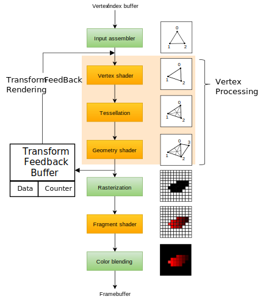

# OpenGL中的Draw
[OpenGL wiki Vertex Rendering](https://www.khronos.org/opengl/wiki/Vertex_Rendering)

# Direct Draw
## Basic Draw
OpenGL中基本的绘制函数是
```cpp
/**
 * mode: 图元类型
 * first: 第一个顶点位置
 * count: 顶点数量
 * glDrawArrays将当前绑定的Vertex从first开始读取count个依次连接绘制成mode
 */
 void glDrawArrays( GLenum mode​, GLint first​, GLsizei count​ );
/**
 * mode: 图元类型
 * count: 顶点数量
 * type: 索引的数据类型（长短整形）
 * indices: Index Buffer Object 的 offset，并不是一个指针而是一个字节偏移量值。Index Buffer是绑定在VAO上的另一个Buffer。
 */
 void glDrawElements( GLenum mode​, GLsizei count​, GLenum type​, void * indices​ );
```

## Multi Draw
目的是从一个VAO（同一个Data Buffer和Index Buffer）中一次性调用多个Draw Call，图元类型、数据类型、渲染管线保持不变。

```cpp
// 非实际实现，但是原理上是要做这么件事
void glMultiDrawArrays( GLenum mode, GLint *first, GLsizei *count, GLsizei primcount )
{
	for (int i = 0; i < primcount; i++)
	{
		if (count[i] > 0)
			glDrawArrays(mode, first[i], count[i]);
	}
}
void glMultiDrawElements( GLenum mode, GLsizei *count, GLenum type, void **indices, GLsizei primcount )
{
	for (int i = 0; i < primcount; i++)
	{
		if (count[i]) > 0)
			glDrawElements(mode, count[i], type, indices[i]);
	}
}
```

## Base Vertex
为了应对分多次调用绘制多个Element，同时还共享VAO的时候。如果Index Buffer中记录的值只是每个Element的相对index（而不是在整个data buffer中的index），则可以用该接口在index值上加上`basevertex`作为实际index值。

```cpp
 void glDrawElementsBaseVertex( GLenum mode​, GLsizei count​,
   GLenum type​, void *indices​, GLint basevertex​);
```

## Instancing
用于在不同位置绘制同一个mesh副本。

```cpp
 void glDrawArraysInstanced( GLenum mode​, GLint first​,
   GLsizei count​, GLsizei instancecount​ );
 void glDrawElementsInstanced( GLenum mode​, GLsizei count​, 
   GLenum type​, const void *indices​, GLsizei instancecount​ );
```
上述接口会调用基本绘制接口`instancecount`次，唯一区别是每次绘制的时候，传给vertex shader一个特殊输入值`gl_InstanceID`，取值范围为[0, instancecount)，由shader决定如何绘制每一个instance副本。

与Base Vertex类似，Instance绘制也有相应的Base Instance接口。

**TODO：** attribute divisor含义和作用。

## Range
用于限制绘制接口对data buffer的读取范围。对于non-indexed绘制来说这并没有必要，因为[first, first + count)就是范围。而对于indexed绘制来说，这免去了驱动层自己根据index buffer判断data buffer使用范围，从而可以只读取一部分data buffer，以此优化性能。

```cpp
 void glDrawRangeElements( GLenum mode​, GLuint start​, 
   GLuint end​, GLsizei count​, GLenum type​, void *indices​ );
```

这里的start end可以理解为是index buffer中数值的最大最小值，也就是data buffer的访问范围。

## 组合
前面提到的indexed、multi、base、instance、range等优化绘制接口可以组合使用，例如`glDrawElementsInstancedBaseVertexBaseInstance`（就很OpenGL风格）。

# Transform Feedback Draw
[OGL Tutorial28 Particle System using Transform Feedback](http://ogldev.atspace.co.uk/www/tutorial28/tutorial28.html)：对该特性的原理、应用场景、使用方法都讲的很全面。（[本地](../material/Tutorial%2028%20-%20Particle%20System%20using%20Transform%20Feedback.html)）

## 背景和概念
<!--img src="../imgs/transform_feedback.svg" width=50% style="float:right" /-->
<div style="float:right; width:50%">


</div>

最早是DirectX10中提出的Stream Output特性，OpenGL 3.0支持了同样的特性并命名为Transform Feedback。

该特性的基本应用场景是，在渲染过程中对Vertex状态迭代修改。最naive的方法是迭代过程在CPU端进行，每次将迭代计算结果重新上传到Device的VBO进行渲染。这样做的问题显而易见
- 带宽瓶颈：大量的Host-Device数据交互。
- 计算瓶颈：迭代计算通常是对每一个Vertex做相似计算，用CPU运算效率低下。

Transform Feedback的想法是直接将迭代运算实现为Vertex Processing步骤中的Vertex Shader和Geometry Shader，用一个额外的Transform Feedback Buffer（XfbBuffer）存储Vertex Processing的输出。然后就可以在后续帧绘制时将该Buffer作为VBO输入使用。另外，由于Geometry Shader可以修改Vertex数量，所以Transform Feedback Buffer中除了data buffer存放数据，还要有counter buffer存放节点数量。用Transform Feedback实现迭代运算的流程如下
- 初始化`Buffer[2]`
- 将两个`Buffer[2]`绑给`xfb[2]`作为Transform Feedback的Buffer对象。
- loop
  - 将`Buffer[i]`绑到Input，`Buffer[1-i]`绑到Transform Feedback
  - 调用Transform Feedback Draw接口，Vertex Processing过程结果存入`Buffer[1-i]`
  - i=1-i

## GL接口和使用
由于Vertex Process的输出可能增删Vertex数量，所以想要使用Transform Feedback的结果作为绘制buffer需要query得到节点数量。为了避免这里的Query开销和将query结果重新传给host的开销，OpenGL提供了Transform Feedback Draw接口，其基本想法是允许直接绘制Transform Feedback的所有结果，而不用额外进行进一步的查询和调用。

```cpp
/**
 * mode: 图元类型
 * id: Transform Feedback 对象
 * stream: Feedback对象中获取vertex count的stream。
 */
void glDrawTransformFeedback(GLenum mode​, GLuint id​);
void glDrawTransformFeedbackStream(GLenum mode​, GLuint id​, GLuint stream​);
```

需要注意的是，上述接口并不会修改VAO，他们的唯一作用是从Transform Feedback对象中获取到图元数量。为了该接口的正常工作，通常需要额外的接口来绑定Transform Feedback对象，以及修改VAO绑定。

# Indirect Rendering
在实际应用场景中，Draw所使用的VAO的各种State经常是要运行时判断的，例如Compute Shader、Geometry Shader、Transform Feedback等。Indirect Draw的基本想法是让GPU自己填充first、count之类的draw参数，而不用经过`GPU->CPU->GPU`的参数读取和设置过程。CPU的工作变成了简单的发出draw请求，以及指定图元类型。

```cpp
/**
 * mode: 图元类型
 * indirect: GL_DRAW_INDIRECT_BUFFER 中的偏移量
 */
void glDrawArraysIndirect(GLenum mode​, const void *indirect​);
```

GL_DRAW_INDIRECT_BUFFER中存放的数据是结构化的绘制信息，其结构体定义如下：
```cpp
typedef  struct {
   GLuint  count;
   GLuint  instanceCount;
   GLuint  first;
   GLuint  baseInstance;
} DrawArraysIndirectCommand;
```

Indirect Draw也有自己的Multi和Indexed样式的接口，只是除了接口样式的不同，存放在GL_DRAW_INDIRECT_BUFFER的数据类型也有不同。

# Conditional Rendering
简单说就是根据Occlusion Query进行条件绘制。

```cpp
glBeginConditionalRender(GLuint id​, GLenum mode​);
glEndConditionalRender();
```
使用方法是所有上述两个接口之间的渲染指令只有在`id`指定的occlusion condition为true的时候才会被执行。

# 其它概念
## 图元重启 Primitive Restart
OpenGL3.X支持的特性，简单说通常的绘制是根据VAO/VBO中的值连接起来，完成场景绘制。但是有些时候buffer中的值是属于多个物体，而且物体之间是不相连的，这时候就需要指定一个中断位置，绘制到这里的时候重启绘制，后面的内容是新的物体。

OpenGL示例使用
```cpp
// Prepare index buffer data (not shown: vertex buffer data, loading vertex and index buffers)
GLushort indexData[11] = {
    0, 1, 2, 3, 4,    // triangle strip ABCDE

    0xFFFF,           // primitive restart index (largest possible GLushort value)
    
    5, 6, 7, 8, 9,    // triangle strip FGHIJ
};

// Draw triangle strips
glEnable(GL_PRIMITIVE_RESTART_FIXED_INDEX);

glDrawElements(GL_TRIANGLE_STRIP, 11, GL_UNSIGNED_SHORT, 0);
```

## Multi Draw
[OpenGL Wiki Multi Draw](https://www.khronos.org/opengl/wiki/Vertex_Rendering#Multi-Draw)