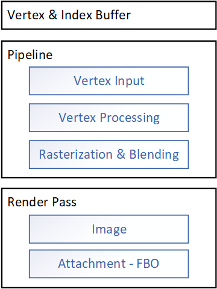

# Render Pass 渲染通道
- [ARM Developer: Render Pass](https://developer.arm.com/documentation/102479/0100/How-render-passes-work)
- [Vulkan Spec: Render Pass](https://www.khronos.org/registry/vulkan/specs/1.0-extensions/html/vkspec.html#renderpass)
- [Stack Overflow: confused about render pass in Vulkan API](https://stackoverflow.com/questions/39551676/confused-about-render-pass-in-vulkan-api)
- [Api Without Secrets: Tutorial 3 First Triangle](https://software.intel.com/content/www/us/en/develop/articles/api-without-secrets-introduction-to-vulkan-part-3.html)

之所以需要Render Pass，最根本的原因是渲染管线的输出并不完全等同于送显结果，我们需要Render Pass来定义如何将渲染结果输出到用于显示的FBO。

> A render pass renders an output image into a set of framebuffer attachments in memory. Each attachment requires initialization in tile memory at the start of the render pass and may then need to be written back out to memory at the end.

对于最简单的绘制场景，Render Pass 的作用并没有那么明显，因为Pipeline的输出结果就是送显结果本身。但是对于一些稍复杂的渲染需求，Render Pass是十分有必要性的。一个常见的应用场景就是**延迟着色(Deffered Shading)**。

延迟着色就需要用到多个subpass，每个subpass负责一部分的渲染任务：
- Subpass 1: 计算并填充Geometry Buffer（G-Buffer，相当于后续阶段的texture），包括Diffuse Color、Normal、Shininess(高光)、depth
- Subpass 2: 计算光照，读取G-Buffer中的数据，计算光照情况后存入另一个texture
- Subpass 3: 综合颜色和光照数据得到最终渲染结果。

render pass在这里充当的作用就是计算和写入texture，以及读取需要的texture。而且只有最终的渲染结果会用于送显，中间的attachment只是充当了texture使用。

## 相关概念
### pass
