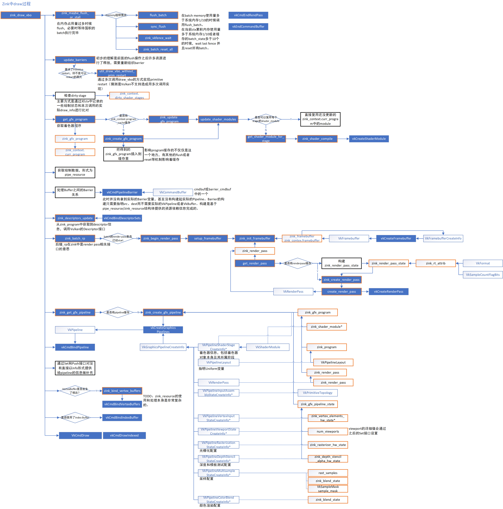
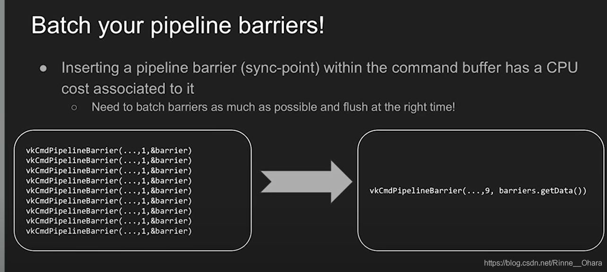

# Zink对Gallium3D的实现
[Gallium3D Documentation](https://dri.freedesktop.org/doxygen/gallium/index.html)

Gallium3D所有对外接口的定义都在`src/gallium/include/pipe/p_context.h`文件中，以`pipe_context`形式给出了驱动需要实现的四大类接口
- 状态设置函数
- 绘制函数
- 资源管理
- 送显函数

Zink则针对`pipe_context`中的需求创建了`zink_context`，以及负责资源管理、pipeline构建、shader缓存等功能的结构，以完成gallium需求。

# 状态设置
## CSO
[Mesa Doc CSO](https://docs.mesa3d.org/gallium/cso.html)

Constant State Objects，是用来实现Gallium状态设置的对象。Constant这里是对于Gallium层而言Constant，CSO对象的使用方式一般遵循以下几步：
- 创建State对象，把希望传递给底层状态机的信息填入State对象。
- 把State对象传递给底层状态机（即实际的Gallium Driver Context），底层状态机根据自己的实现，创建CSO对象，并且把对象的指针以`void *`形式返回回来。
- Gallium层拿到CSO对象之后，可以在需要使用的时候把CSO对象绑定（Bind）给状态机进行状态机设置。

对于Gallium层来说，CSO的实际实现是完全的黑箱状态，`void *`类型也保证Gallium层无法读取和修改CSO中的内容，想要使用只能重新把CSO传递给驱动层状态机。这种接口形式实际上正是OpenGL一般的接口形式，CSO对象也就对应到以`Gluint`形式返回的gl对象。

CSO对象可以负责管线设置的方方面面，包括
- Blend 颜色渲染
- 深度、模板、透明度测试
- 光栅化
- 采样
- 着色器
- Vertex Elements

**注意：** CSO并不是架构的一部分，在Mesa-Gallium架构中并没有一个所谓的“CSO层”，它是一个实现上的概念，指那些与状态设置有关的，由底层状态机实现的，在上层接口中只读的，以绑定的方式进行使用的对象。

**TODO：** CSO对象与GL接口关系。GL的许多接口类型也遵循Create-Bind-Delete的接口形式，这部分接口是否与CSO关联

### gallium-zink对CSO实现
gallium pipe_context 对每一种CSO对象的create、bind、delete接口进行了定义，相当于c++中的虚函数。

zink zink_context 继承了pipe_context，实现了每一个虚函数，并定义了CSO对象的实现，gallium CSO对象与Zink CSO对象之间的映射关系如下（xx指create-bind-delete三类接口，Option为Gallium对CSO进行配置的参数，Zink CTX Bind为CSO对象在Zink状态机中的绑定点）

Gallium Interface | Gallium Option | Zink CSO | Zink CTX Bind | Details
-- | -- | -- | -- | --
xx_blend_state | pipe_blend_state | zink_blend_state | gfx_pipeline_state<br /> -> blend_state | -
xx_sampler_state | pipe_sampler_state | zink_sampler_state | sampler_states[][] | -
xx_rasterizer_state | pipe_rasterizer_state | zink_rasterizer_state | gfx_pipeline_state <br /> -> rast_state | -
xx_depth_stencil_alpha_state | pipe_depth_stencil_alpha_state | zink_depth_stencil_alpha_state | gfx_pipeline_state <br /> -> depth_stencil_alpha_state | -
xx_fs/vs/gs/tcs/tes_state | pipe_shader_state | zink_shader | gfx_stages[] | -
xx_vertex_elements_state | pipe_vertex_element | zink_vertex_elements_state | gfx_pipeline_state <br /> -> element_state | -


**潜在优化点：** 
- 很多CSO对象在zink中都有两个绑定点，一个是在pipeline中，另一个是单独存在的。考虑到状态机单线程特性，这是否有其必要？或者说两个绑定点意义在哪？
- 对接口进行拆分（例如 fragment shader 和 vertex shader 的 bind 接口）是否可以减少判断逻辑？
- 所有state对象均在create接口中calloc，在delete接口中free，是否可以通过pool机制减少内存分配，用reset替代calloc，用unuse替代free。甚至于是否可以将该工作直接在初始化状态机时完成。

## 非CSO状态设置
在Gallium状态设置接口中，除了Create-Bind-Delete形式设置状态外，也有部分直接对状态进行设置的接口，Gallium将这部分接口作为 Parameter-like state 进行了声明，接口形式均为`set_xxx`，zink中对应的实现则是`zink_set_xxx`。

这部分接口设置的值通常是简单的变量或者向量，而不像CSO接口包含复杂的option。

Gallium Interface | Gallium Option | Zink_CTX_Bind | Details
-- | -- | -- | --
set_blend_color | pipe_blend_color | blend_constants | -
set_stencil_ref | pipe_stencil_ref | stencil_ref | -
set_sample_mask | unsigned sample_mask | gfx_pipeline_state<br />-> sample_mask | 会导致gfx_pipeline_state.dirty
set_min_samples | unsigned min_samples | 未实现 | -
set_clip_state | pipe_clip_state | 空函数| -
set_constant_buffer | shader type&index,<br />pipe_constant_buffer | ubos | 牵扯到先前ubo的invalid
set_inlinable_constants | shader type, var number, values[] | inlinable_uniforms | zink似乎没记录inlinable_uniform数量？好像是直接`MAX_INLINABLE_UNIFORMS`控制的，但是又没在该接口验证是否越界。
set_framebuffer_state | pipe_framebuffer_state | fb_state, framebuffer | -
set_sample_locations | locations | 未实现 | -
set_polygon_stipple | pipe_poly_stipple | 空函数 | -
set_scissor_states | pipe_scissor_state | vp_state <br />->scissor_states[] | -
set_window_rectangles | pipe_scissor_state | 未实现 | -
set_viewport_states | pipe_viewport_state | vp_state <br />-> viewport_states[],  <br />gfx_pipeline_state<br />-> num_viewports| -
set_sampler_views | shader type, pipe_sampler_view | sample_views[] | -
set_tess_state | outer/inner level | default_inner_level, default_outer_level | -
set_debug_callback | pipe_debug_callback | 未实现 | -
set_shader_buffers | shader type, index, pipe_shader_buffer, writable | ssbo, di.ssbos | -
set_hw_atomic_buffers | pipe_shader_buffer | 未实现 | -
set_shader_images | shader type, index, pipe_image_view | image_views | -
set_vertex_buffers | pipe_vertex_buffer | vertex_buffers <br />gfx_pipeline_state<br />-> vertex_state_dirty | 需要在pipeline中添加一个barrier

# 绘制
在Gallium的上层，Draw函数的接口非常繁多，而到了Gallium层，则统一通过`draw_vbo`接口完成绘制。



## dirty 问题

**潜在优化点：** 在dirty为true的情况下，许多对dirty的判断是多余的。

# 资源管理
## Stream Output Targets & Transform Feedback
- [Mesa Doc Stream Output Targets](https://docs.mesa3d.org/gallium/context.html#stream-output-targets)
- [OpenGL Wiki Transform Feedback](https://www.khronos.org/opengl/wiki/Transform_Feedback)
- [OpenGL Wiki Vertex Processing](https://www.khronos.org/opengl/wiki/Vertex_Processing)
- [Vulkan Spec Transform Feedback](https://vulkan.lunarg.com/doc/view/1.2.141.2/mac/chunked_spec/chap25.html#vertexpostproc-transform-feedback)

是为了实现OpenGL的Transform Feedback机制，该机制允许将`Vertex Processing`过程的输出存入`Buffer Object`，已达到primitives复用的目的。

**补充：** `Vertex Processing`主要指Vertex Shader、Tessellation、Geometry Shader三个步骤。

和CSO对象不同，Gallium层实现了Stream Out类作为相关接口的返回值和参数
```cpp
struct pipe_stream_output_target
{
   struct pipe_reference reference;
   struct pipe_resource *buffer; /**< the output buffer */
   struct pipe_context *context; /**< context this SO target belongs to */

   unsigned buffer_offset;  /**< offset where data should be written, in bytes */
   unsigned buffer_size;    /**< how much data is allowed to be written */
};
```

`pipe_stream_output_target`中并不包含实际的`vkBuffer`对象，而只包含了xfbBuffer的信息。实际绑定Transform Feedback的过程是在draw过程中，调用`zink_emit_stream_output_targets`函数完成的，该函数基本逻辑是：


## Transfer 和 Map 接口

## Barrier
**潜在优化点：** 多个Barrier应当尽可能batch使用，然而在zink当前实现中，barrier都是一个一个插入，每插入一个barrier就要调用一次`vkPipelineBarrier`。而Vulkan则明确推荐将多个barrier作为一个batch插入。


# 送显
送显包含两部分，一部分是与显示直接相关的`flush`和`surface`相关接口，用来调用刷新以及设定渲染目标等；另一部分是处理同步机制的接口，主要有管理流程之间的fence和管理资源依赖的barrier。

# Query 接口
初步认为和Conditional Rendering的实现有关。

# Compute 接口
Compute更多地用于并行计算而非绘图。Compute != Geometry Shader