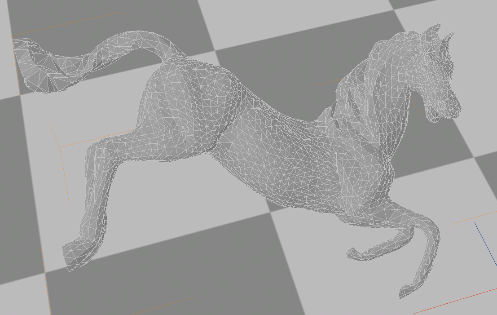

## 架构
glmark2架构总体非常简单，`src`目录下文件包含了核心基类和各个场景的实现，整体上都是面向对象的。

- main-loop.h/MainLoop: 用来执行主循环，`foreach scene`，执行并拿到评分。
- benchmark.cpp/Benchmark: 测试场景的描述类，保存了scene和对scene的配置
- canvas.h/Canvas: GL渲染输出目标的虚类，不同的平台和环境会使用不同的Canvas实现
- scene.cpp/Scene: 所有测试场景的基类。
- scene-xxx.cpp: 特定场景的测试类实现，是Scene的派生。需要注意的是，所有派生类的声明都在`scene.h`里面。
- libmatrix/program.cc/Shader: 用来加载和编译Shader，调用OpenGL的Shader相关接口。
- libmatrix/program.cc/Program: 用来组装和运行Program，调用OpenGL的Program相关接口。

## 测试执行过程
- main.cpp/do_benchmark: 创建`MainLoop`对象，循环执行`MainLoop.step()`直到`step()`函数返回`false`，输出`MainLoop.score()`
  - main-loop.cp/MainLoop.step(): 读取传入的`BenchmarkCollection`中的下一个`Benchmark`，对其中包含的测试进行场景初始化和执行。在执行过程中会首先检查当前场景是否还在运行，如果还在运行，那么就继续调用`MainLoop.draw()`
    - Benchmark.setup_scene(): 完成场景的初始化和设定，调用`Scene.setup()`
    - MainLoop.draw():
      - Canvas.clear():
      - Scene.draw(): 核心绘制过程，根据`update()`的影响重置视角之类，重新执行渲染函数。
      - Scene.update(): 通常用来更新场景，比如给模型转个角度
      - Canvas.update()
    - 执行场景资源的释放，如果已经没有场景需要运行了就返回false

执行过程中，实际的测试运行是通过`Scene.draw()`，其他大多数是框架代码，所以需要分析的只是每个`scene-xxx.cpp`中的`draw()`函数实现。

## 场景列表
build, texture, shading, bump, effect2d, pulsar, desktop, buffer, ideas, jullyfish

## Scene: build
是最简单的渲染场景，加载单个无文理模型，单点光源，模型颜色为白色，不透明，漫反射颜色直接用法向乘光线方向得到。

### 可选参数
- use-vbo: 默认true
- interleave: 默认false，Whether to interleave vertex attribute data
- model: 默认horse

### setup()
加载shader，编译shader，组装并使用program:
- Vertex Shader /shaders/light-basic.vert: 基本的点光源漫反射，顶点颜色=材质颜色*$(N\cdot L)$
- Frame Shader /shaders/light-basic.frag: 

加载模型
- Model data/models/horse.3ds: 只加载了顶点和法线信息
- Texture 无

模型查看

### draw()
根据旋转值调整viewpoint，根据是否使用`vbo`决定是否通过`glBindBuffer`绑定vbo对象，然后调用`glDrawArrays`绘图。

### update()
更新旋转值

## TODO
- 啥叫interleave vertex attribute data?

## Scene: texture
主要测试不同纹理滤波方法

### 可选参数
- model: 默认cube
- texture-filter: 纹理过滤的方法，默认nearest
    - nearest
    - linear
    - linear-shader
    - mipmap
- texture: 使用的纹理，默认crate-base
- texgen: 是否需要生成纹理坐标，默认false

### setup()
根据选择的纹理过滤方法定义min_filter和mag_filter

根据是否选择生成纹理坐标、是否使用双线性过滤加载shader，并向vertex shader传入光源位置与材料漫反射参数等常量
- vertex shader
    - 不生成纹理坐标：light-basic.vert
    - 生成纹理坐标：light-basic-texgen.vert
- fragment shader
    - 非线性过滤：light-basic-tex-bilinear.frag：像素颜色=顶点颜色*纹理颜色
    - 线性过滤：light-basic-tex.frag: 像素颜色=顶点颜色*纹理颜色，纹理颜色线性过滤而来
    
加载模型，特定模型需要进行特定旋转，并根据需要计算模型法向量和纹理坐标

将model转换为mesh，本case中默认使用vbo

计算透视投影矩阵

### draw()
调整model_view

激活和绑定纹理

调用 render_vbo进行绘图

### update()
同其他，更新旋转值

## Scene:shading
主要测试不同着色模型

### 可选参数
- model: 默认cat
- shading: 选择着色模型，默认gouraud
    - gouraud
    - blinn-phone-inf
    - phone
    - cel
- num-lights：场景光源的数量，默认为1（只针对phone光照模型）

### setup()
为blinn-phone模型计算half-vector

根据选择的shading方式加载不同的shader，并向shader传入常量
- gouraud shading
    - light-basic.vert， 传入光源位置和漫反射参数
    - light-basic.frag
- blinn-phone-inf shading
    - light-advanced.vert
    - light-advanced.frag，传入光源位置和光源half vector 
- phone shading
    - light-phong.vert
    - light-phong.frag，注意这里要根据光源数量依次传入光源位置和颜色，并传入漫反射参数
- cel shading
    - light-phong.vert
    - light-cel.frag
    
加载模型，旋转、计算法向量等，同上

将model转换为mesh，本case中默认使用vbo

计算透视投影矩阵

### draw()
调整model_view

将ModelViewProjectionMatrix, NormalMatrix, ModelViewMatrix加载到shader中

本case中没有使用纹理

调用render_vbo进行绘图，默认使用vbo

### update()
同其他case， 更新旋转值

## 以下部分相似内容不再重复

## Scene: bump
主要测试对同一模型的不同渲染方式

### 可选参数
- bump-render：bump的渲染方式，默认off
    - off
    - normals
    - normals-tangent
    - height
    - high-poly

### setup()
此用例不可选择model，没有加载model列表，默认使用小行星模型

根据选择的render方式加载不同的shader，计算half-vector，并向shader传入相应常量

- off或high-poly（high-poly与其他的区别是使用的是asteroid-high模型
    - bump-poly.vert，提供点的位置和法线信息
    - bump-poly.frag，传入光源位置，光源half vector
- normals
    - bump-normals.vert，提供点的位置和纹理信息
    - bump-normals.frag，传入光源位置，光源half vector
    - model:asteroid-normal-map
- normals-tangent
    - bump-normals-tangent.vert，提供点的位置，纹理，法线和切线信息
    - bump-normals-tangent.frag，传入光源位置，光源half vector
    - model:asteroid-normal-map-tangent
- height
    - bump-height.vert，提供点的位置，纹理，法线和切线信息
    - bump-height.frag，传入光源位置，光源half vector，纹理x方向step和纹理y方向step
    - model：asteroid-height-map

将model转换为mesh，本case中默认使用vbo

### draw()和update()同上

## Scene: effect2d
主要测试不同的卷积核对2D图像卷积的影响（通过创建实现2D图像卷积的fragment shader）

### 可选参数
- kernel: 卷积核，默认"0,0,0;0,1,0;0,0,0"
- normalize: 是否归一化给定的卷积核

### setup()
加载shader
- effect-2d.vert，提供每个顶点的position，线性映射到纹理的坐标
- effect-2d-convolution.frag，通过变量替换的方式在setup()中进行了卷积计算的代码，提供TextureStepX和TextureStepY

### draw()
本样例就是绑定固定的纹理图片进行2D卷积

## Scene: pulsar
主要测试alpha透明混合处理（即半透明场景的展示）

### 可选参数
- quads: 场景中方形纸片的数量，默认为5
- texture: 是否渲染纹理，默认为false
- light: 场景中是否有光照，默认为false
- random: 是否随机模型的旋转速度，默认为false

### setup()
禁用后脸消除(back-face culling)

启用alpha透明混合(alpha blending)

进行颜色混合但不改变目标像素的alpha值：glBlendFuncSeparate(GL_SRC_ALPHA, GL_ONE_MINUS_SRC_ALPHA, GL_ZERO, GL_ONE);

为每个quad设定一定的旋转速度（根据是否随机旋转速度而不同）

加载shader
- vertex shader
    - 添加光照：pulsar-light.vert，需要以常量形式传入光源位置
    - 不添加光照：pulsar.vert
- fragment shader
    - 添加纹理：light-basic-tex.frag
    - 不添加纹理：light-basic.frag

创建并setup mesh，向vertex shader传入顶点的位置，颜色，纹理坐标和法向量信息
- 此case直接手动创建一个quad包括顶点位置，颜色，纹理，法向量等，而不是从model文件中读取，在create_and_setup_mesh()中完成

### update()
对每一个quad用其特定的旋转速度乘所过时间得到这一帧该quad的旋转角度

### draw()
对每个quad加载modelViewProjectMatrix，如果启用了光照还得加载normalMatrix

默认使用render_vbo

