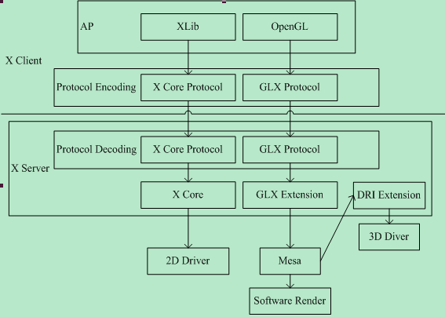
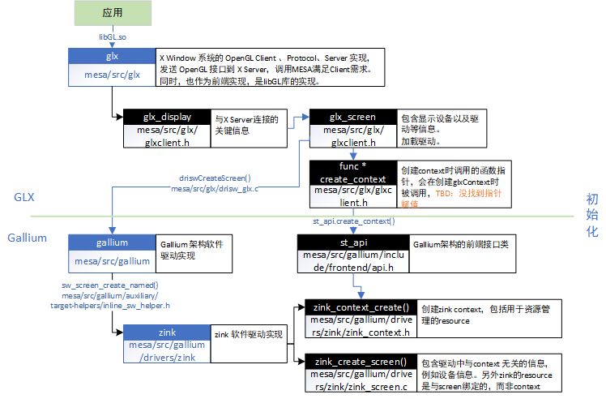

blog 中提到了 **CTS isn’t a great tool for zink at the moment due to the lack of provoking vertex compatibility support in the driver**. 从中可以看出软件驱动路线天然缺少**provoking vertex capatibility support**造成了CTS的测试失败，这也可能是piglit中出现 50 个fail的原因。这是个 Vulkan 级别的问题，而不是 zink 级别的。

blog 中提到了包括上面原因的两个 piglit 测试失败的愿意：
- 前面提到的 provoking vertex issues
- corner case missing features such as multisampled ZS readback

## 常用链接

- [Gallium3D架构介绍](https://www.gpudocs.com/2019/12/13/Gallium3D)
- [Gallium3D wiki](https://www.freedesktop.org/wiki/Software/gallium/GAOnlineWorkshop/)
- [Vulkan教程翻译文档](https://blog.csdn.net/hccloud/category_7900178.html)
- [电子书《Learning Modern 3D Graphics Programming》](https://nicolbolas.github.io/oldtut/index.html)
- [mesa master git](https://gitlab.freedesktop.org/mesa/mesa)
- [mesa mike git](https://gitlab.freedesktop.org/zmike/mesa/-/tree/zink-wip)
- [mesa mainpage](http://mesa.sourceforge.net/index.html)
- [apitrace 及其替代工具](http://apitrace.github.io/)
- [一篇介绍zink 和 vulkan 的博客](https://www.collabora.com/news-and-blog/blog/2018/10/31/introducing-zink-opengl-implementation-vulkan/)
- [Aiglx学习总结](https://blog.csdn.net/hustwarhd/article/details/1907364?%3E)
- [介绍glx的很丑陋的博客](https://blog.csdn.net/eydwyz/article/details/107099072)

## 常用指令
### 编译RST文档
`sphinx-build -b html [文档目录] [html存放目录]`

### 覆盖本地修改
```bash
git fetch --all
git reset --hard origin/zink-wip
git pull
```

### mesa 编译
编译安装
```bash
meson -Dvulkan-drivers=amd -Dgallium-drivers=swrast,zink,radeonsi -Dlibunwind=false build-zink
ninja -C build-zink/ install
```
安装后可在`/usr/local/lib/x86_64-linux-gnu/dri`路径下可以看到zink相关的链接库文件。

测试运行
```bash
MESA_LOADER_DRIVER_OVERRIDE=zink glxgears -info
MESA_GL_VERSION_OVERRIDE=3.3
```

查看当前编译选项
```bash
meson configure build-zink/
```
设置编译选项
```bash
meson configure build-zink/ -D vulkan-drivers=intel
```

### 禁用AMD显卡
通过BIOS修改默认显卡即可，记得改完之后把显示器插到集显上。
<!--
```bash
lspci -nnk | grep -i vga -A3 | grep 'in use'
sudo gedit /etc/default/grub
```

Modify the following line by adding radeon.modeset=0:
```bash
GRUB_CMDLINE_LINUX_DEFAULT="quiet splash radeon.modeset=0"
```
-->

### 处理包依赖问题
```
正准备解包 …/libreadline7_7.0-3_i386.deb …
正在将 libreadline7:i386 (7.0-3) 解包到 (7.0-1) 上 …
dpkg: 处理归档 /var/cache/apt/archives/libreadline7_7.0-3_i386.deb (–unpack)时出错：
尝试覆盖共享的 ‘/usr/share/doc/libreadline7/changelog.Debian.gz’, 它与软件包 libreadline7:i386 中的其他实例不同
在处理时有错误发生：
/var/cache/apt/archives/libreadline7_7.0-3_i386.deb
E: Sub-process /usr/bin/dpkg returned an error code (1)
解决方案

#备份原来的dpkg info
sudo mv /var/lib/dpkg/info /var/lib/dpkg/baks
#建立新的bpdk info文件夹
sudo mkdir /var/lib/dpkg/info

sudo apt-get update

sudo apt-get install -f
#讲新的追加到新备份中
sudo mv /var/lib/dpkg/info /var/lib/dpkg/baks
#删除不要的
sudo rm /var/lib/dpkg/info -r
#重新设为info
sudo mv /var/lib/dpkg/baks /var/lib/dpkg/info
```

## 测试工具
### apitrace
生成trace
```bash
apitrace trace -o 输出文件名.trace 要执行的OpenGL程序以及其参数
```

查看trace
```bash
qapitrace 文件名.trace
```

生成profile文件
```bash
apitrace replay --pcpu --pgpu --ppd 文件名.trace > 文件名.profile
```
用`replay`命令查看运行情况，统计cpu、gpu运行时间以及像素绘制数量等参数。需要注意的是，这部分信息并不在trace文件中，`replay`命令是通过按照trace文件内容重新运行每个接口，才得到了分析结果。

目前发现有个现象是`replay`结果普遍比实际运行差，某次运行的对比如下

- |zink | 硬件驱动
- | - | -
运行时帧数 | 1399 | 4252
replay帧数 | 398 | 2122

## 关于 GLX
### X Window
是linux下最流行的窗口系统，它采用客户/服务器模式。所有的资源（屏幕、字体、window、gc等）都由服务器来管理，客户端唯一所能做的就是请求服务器做某些操作，如画一条直线，创建窗口等。

X Window 主要分为3部分：客户端、协议和服务器。所有基于X的程序都可以看成是一个客户端，该程序可以看成是命令集，这些命令通过协议发送到服务器，服务器根据协议定义的格式解析这些命令，然后按照命令去执行相应的操作。

### GLX
应用程序作为Client，将对OpenGL的调用通过GLX协议将接口函数发送到X Server，X Server解析之后调用Mesa来满足Client请求，将绘制结果输出到屏幕。

GLX 是 X Window 的 OpenGL 扩展，实现了 X Client/Server 发送、解析并执行 OpenGL 请求的功能，GLX 并不实现3D效果的渲染，而是实现了OpenGL的接口和对MESA的调用。



# 从功能角度分析 GLX-ST-ZINK-Vulkan架构

## 架构需要实现的功能包括
- 初始化，context的创建、设备和驱动的关联、设备参数读取、渲染和指令缓冲创建。
- 着色器编译实现
- 绘图指令实现
- 帧缓冲区管理

## 初始化


## 着色器的编译
着色器通常使用 Internal Representation (IR) 来编写，在我们的架构中，问题的复杂性在于有好多种IR
- GLSL：给程序员用的，直接在OpenGL程序中编写的IR
- NIR：OpenGL着色器编译的目标代码，是GPU驱动可以直接使用的指令。
- SPIR-V：Vulkan使用的IR，Vulkan的目标是替代OpenGL，SPIR-V就是与GLSL对应的IR。

Zink的定位是MESA和Vulkan之间的translator，所以Zink的着色器输入是NIR，而输出是Vulkan的输入SPIR-V，结果就是整个着色器编译过程中，发生了反复的正向和反向的编译：
```
应用（GLSL）
Mesa（GLSL -> NIR）
Zink（NIR -> SPIR-V）
Vulkan（SPIR-V -> NIR）
```
  
### GLuint glutil::CompileShader(shader类型, GLSL程序)
- 功能：编译GLSL IR（internal representation）编写的着色器
- 通过dispatch调用到`mesa/src/mesa/main/shaderapi.c`中实现的函数，包括
  - `GLuint GLAPIENTRY _mesa_CreateShader(GLenum type)`
  - `void GLAPIENTRY _mesa_CompileShader(GLuint shaderObj)`

